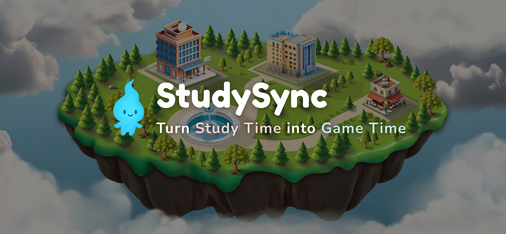
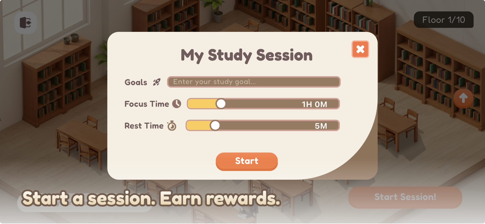
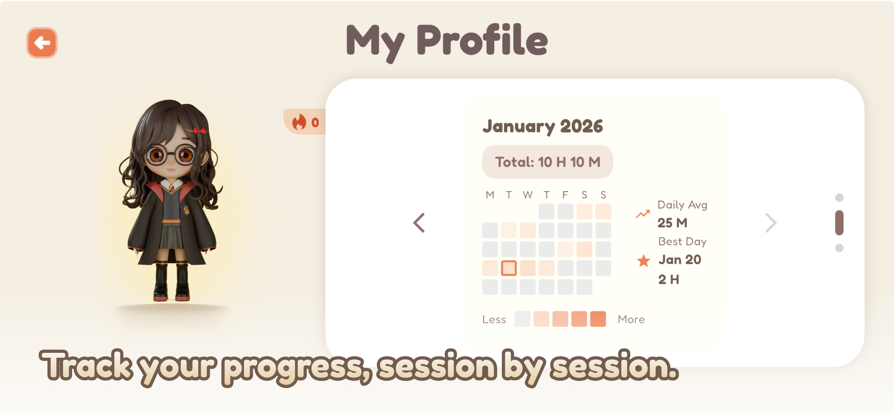
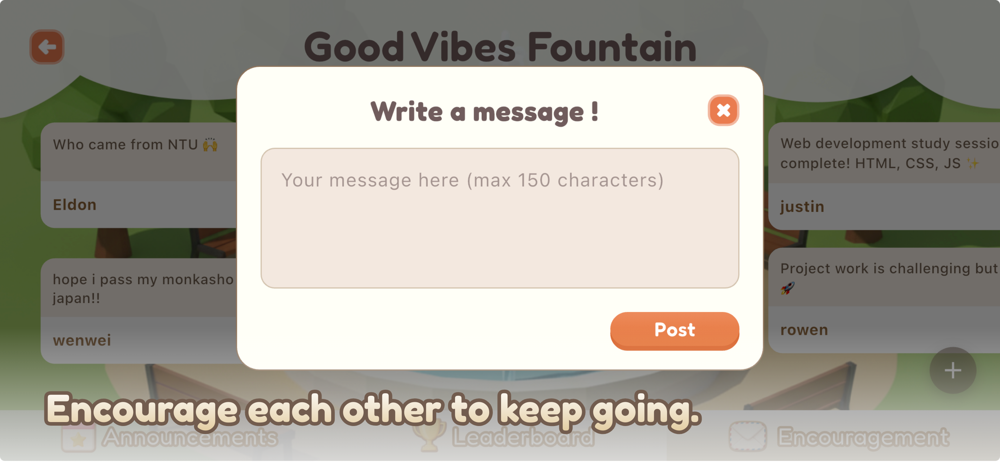
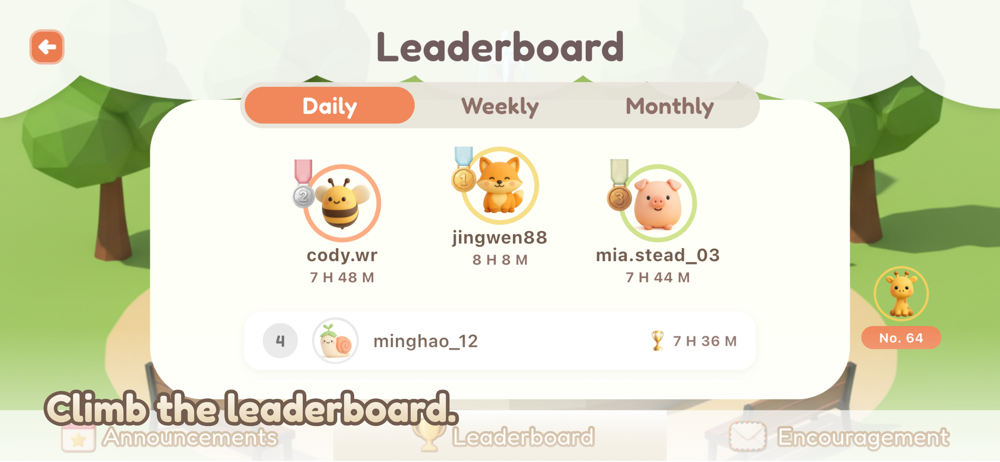
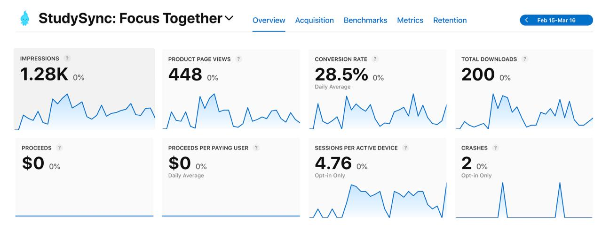
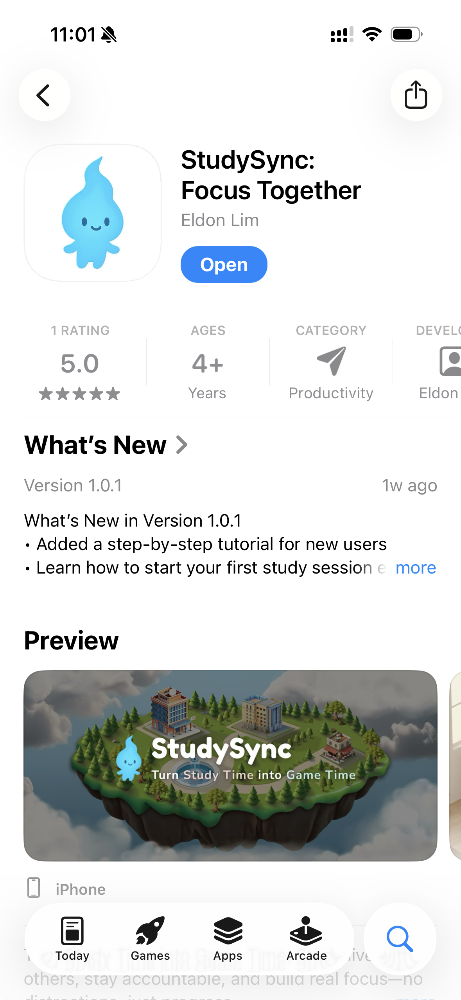

# StudySync

StudySync is a gamified focus and virtual study app designed to make independent studying more immersive, motivating, and community-driven.

This repository serves as our public SEP project page for iLab reporting and progress tracking.

---

## 1. Project Overview

StudySync was created to address a common problem faced by students and self-learners: studying alone can feel isolating, unmotivating, and difficult to sustain. Many existing productivity tools are functional but not emotionally engaging, while some “study together” alternatives require cameras and create friction for users who prefer a lower-pressure experience.

Our project explores how self-learning can be made more immersive and rewarding by combining:
- focus sessions,
- gamification,
- low-friction social accountability,
- and a sense of community.

StudySync is positioned as a virtual study space where users can focus, build habits, and feel like they are studying alongside others.

---

## 2. SEP Objectives

Our objectives under SEP are to:

- develop and refine StudySync as a mobile product,
- validate the product concept with real users,
- improve the app’s user experience and core functionality,
- build traction through testing, launch, and user feedback,
- document development and startup progress over time,
- prepare for future growth through partnerships, marketing, and potential fundraising.

---

## 3. Problem Statement

We are addressing the question:

**How might we reinvent self-learning so independent studying becomes as immersive, rewarding, and habit-forming as social media?**

### Key pain points
- Studying alone often feels isolating and easy to quit.
- Existing focus apps can feel too static or utility-based.
- Some study-with-others platforms rely on camera use, which creates friction for users.
- Many learners need structure, motivation, and accountability without pressure.

### Target users
- Students aged 13+
- University students
- Remote learners
- Individuals who struggle with procrastination or distraction

---

## 4. Our Solution

StudySync is a gamified study app where users can:
- focus through structured study sessions,
- experience a more immersive virtual study environment,
- stay motivated through progress-oriented and game-like elements,
- and benefit from social accountability without relying on live camera interaction.

Our product vision is to make studying feel less lonely, more engaging, and more sustainable as a habit.

  
  

  
  

  
  

---

## 5. Team Composition

### Eldon Lim Kai Jie
- NTU Year 3
- Computer Science, with Second Major in Business
- Role: Full-stack development, coordination, product execution, partnerships and outreach

### Lean Yi Fan
- NTU Year 3
- Computer Science
- Role: Product, design, storytelling, and marketing

---

## 6. Project Start Date

- **Start Date:** October 2025

---

## 7. Finance / Budget

- **SEP Funding Amount:** S$1,500

---

## 8. Current Status

- StudySync has been launched on the **App Store**.
- As of **18 March 2026**, StudySync has achieved:
  - **200 downloads**
- We continue to refine the app based on user feedback and usage data.

  

---

## 12. Pitch Deck

- 

---

## 13. Progress Updates

This section is updated regularly as part of SEP reporting.

### Progress Update 1 — Project Overview
- **Date:** January 2026
- **YouTube Link:** [[Click Here](https://youtu.be/3u-rq8rnahw)]

---

### Progress Update 2 — Launch and Post-Launch Progress
- **Date:** March 2026
- **YouTube Link:** [Click Here]

---

## 16. Contact

- Website: **https://studysync.sg**
- Instagram: **@studysync.app**
- Email: **eldon@studysync.sg**
- Contact Number: **89094326**
